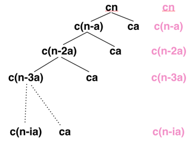

### Exercises 4.2-1
***
Use a recursion tree to determine a good asymptotic upper bound on the recurrence 
%20=%203T\(\\lceil%20n/2%20\\rceil\)%20+%20n). Use the substitution method to verify your answer.

### `Answer`

树的高度是lgn,有3^lgn个叶子节点.

%20=%20n\\sum_{i%20=%200}^{lg\(n\)-1}\(\\frac{3}{2}\)^i%20+%20\\Theta\(3^{\\lg{n}}\)%20\\\\%20%20~%0d%0a\\hspace{15%20mm}%20=%20\\Theta\(n^{\\lg{3}}\)%20+%20\\Theta\(3^{\\lg{n}}\)%20\\\\%20%20~%0d%0a\\hspace{15%20mm}%20=%20\\Theta\(n^{\\lg{3}}\)%20+%20\\Theta\(n^{\\lg{3}}\)%20\\\\%20%20~%0d%0a\\hspace{15%20mm}%20=%20\\Theta\(n^{\\lg{3}}\)%0d%0a)

我们猜想 %20\\le%20cn^{\\lg{3}}+2n%20)

%20\\le%203c\(n/2\)^{\\lg{3}}%20+%202n%20%20\\\\%20%20~%0d%0a\\hspace{15%20mm}%20\\le%20cn^{\\lg{3}}+2n%20%20\\\\%20%20~%0d%0a\\hspace{15%20mm}%20=%20\\Theta\(n^{\\lg{3}}\)%0d%0a)

### Exercises 4.2-2
***
Argue that the solution to the recurrence
%20=%20T\(n/3\)%20+%20T\(2n/3\)%20+%20cn%20) 
, where c is a constant, is Ω(nlgn) by appealing to the recurrsion tree.

### `Answer`
最短的叶子高度是lg3n,每一层都要cn.也就是说，只考虑最短叶子的那一层（忽略其他层）已经有cnlg3n.

### Exercises 4.2-3
***
Draw the recursion tree for 
%20=%204T\(\\lfloor%20n/2%20\\rfloor\)%20+%20cn)
,where c is a constant, and provide a tight asymptotic bound on its solution. Verify your bound by the substitution method.
### `Answer`

很明显是n^2的级别

我们假设 %20\\le%20n^2+2cn)

%20\\le%20%204c\(n/2\)^2%20+%202cn/2+cn%20\\le%20cn^2+2cn)

我们假设 %20\\ge%20n^2+2cn)

%20\\ge%20%204c\(n/2\)^2%20+%202cn/2+cn%20\\ge%20cn^2+2cn)

### Exercises 4.2-4
***
Use a recursion tree to give an asymptotically tight solution to the recurrence T(n) = T(n - a) + T(a) + cn, where a ≥ 1 and c > 0 are constants.

### `Answer`

 %20=%20\\sum_{i=0}^{n/a}c\(n-ia\)%20+%20\(n/a\)ca%0d%0a=%20\\Theta\(n^2\))

我们假设 %20\\le%20cn^2)

%20\\le%20c\(n-a\)^2%20+%20ca%20+%20cn%20%20\\\\%20%20~%0d%0a\\hspace{15%20mm}%20\\le%20cn^2-2acn+ca+cn%20%20\\\\%20%20~%0d%0a\\hspace{15%20mm}%20\\le%20cn^2-c\(2an-a-n\)%20\\\\%20%20~%0d%0a\\hspace{15%20mm}\\le%20cn^2%20-%20cn%20~~~~%20if%20~~%20a%20>%201/2,n%20>%202a%20\\\\%20%20~%0d%0a\\hspace{15%20mm}\\le%20cn^2%20\\\\%20%20~%0d%0a\\hspace{15%20mm}%20=%20\\Theta\(n^2\)%0d%0a)

另外一个方向的证明和这个基本一样.

### Exercises 4.2-5
***
Use a recursion tree to give an asymptotically tight solution to the recurrence T(n) = T(αn) +
T((1 - α)n) + cn, where α is a constant in the range 0 <α < 1 and c > 0 is also a constant.

### `Answer`

可以假设α < 1/2,因此树的高度有

%20=%20\\sum_{i%20=%200}^{\\log_{1/%20\\alpha}{n}}cn%20+%20\\Theta\(n\)%20=%20cn\\log_{1/%20\\alpha}{n}%20+%20\\Theta\(n\)%20=%20\\Theta\(n\\lg{n}\)%20)

***
Follow [@louis1992](https://github.com/gzc) on github to help finish this task.

