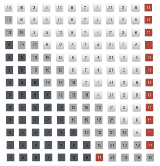

### Exercises 7.1-1
***
Using Figure 7.1 as a model, illustrate the operation of PARTITION on the array A = [13, 19, 9, 5, 12, 8, 7, 4, 11, 2, 6, 21].

### `Answer`

### Exercises 7.1-2
***
What value of q does PARTITION return when all elements in the array A[p...r] have the same value? Modify PARTITION so that q = (p+r)/2 when all elements in the array A[p...r] have the same value.

### `Answer`
会返回r.

[code](./exercise_code/quicksort.py)

### Exercises 7.1-3
***
Give a brief argument that the running time of PARTITION on a subarray of size n is Θ(n).

### `Answer`
n次迭代，每个迭代内都是常数时间的操作.

### Exercises 7.1-4
***
How would you modify QUICKSORT to sort into nonincreasing order?

### `Answer`
将A[j] <= x的条件改为 A[j] >= x

***
Follow [@louis1992](https://github.com/gzc) on github to help finish this task.

