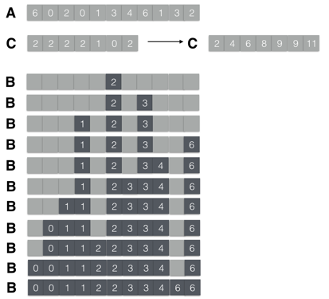

### Exercises 8.2-1
***
Using Figure 8.2 as a model, illustrate the operation of COUNTING-SORT on the array A = [6, 0, 2, 0, 1, 3, 4, 6, 1, 3, 2].

### `Answer`

### Exercises 8.2-2
***
Prove that COUNTING-SORT is stable.

### `Answer`
COUNTING-SORT最后是从后面往前面扫，并且把遇到的每一个item放在同大小(key)的最后面的位子.所以不改变相对顺序.

### Exercises 8.2-3
***
Suppose that the for loop header in line 9 of the COUNTING-SORT procedure is rewritten 

as 9 for j ← 1 to length[A]

Show that the algorithm still works properly. Is the modified algorithm stable?

### `Answer`
可以正常工作，只是不stable.

### Exercises 8.2-4
***
Describe an algorithm that, given n integers in the range 0 to k, preprocesses its input and then answers any query about how many of the n integers fall into a range [a...b] in O(1) time. Your algorithm should use Θ(n + k) preprocessing time.

### `Answer`
利用数组C,[a,b]间的个数是C[b]-C[a-1].(C[-1] = 0)

***
Follow [@louis1992](https://github.com/gzc) on github to help finish this task.

