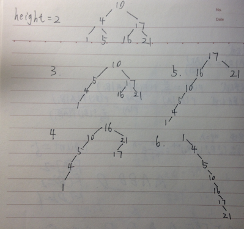
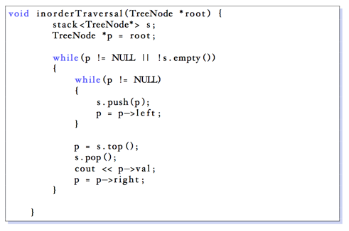
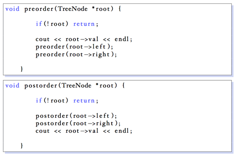

### Exercises 12.1-1
***
For the set of keys {1, 4, 5, 10, 16, 17, 21}, draw binary search trees of height 2, 3, 4, 5, and 6.

### `Answer`
1

### Exercises 12.1-2
***
What is the difference between the binary-search-tree property and the min-heap property (see page 129)? Can the min-heap property be used to print out the keys of an n-node tree in sorted order in O(n) time? Explain how or why not.

### `Answer`
做不到,因为基于比较的排序的上限是 n lg n。堆排序建堆时间是 O(n), 但是每次 拿出去后要用 lg n 的时间去调整。

### Exercises 12.1-3
***
Give a nonrecursive algorithm that performs an inorder tree walk. (Hint: There is an easy solution that uses a stack as an auxiliary data structure and a more complicated but elegant solution that uses no stack but assumes that two point- ers can be tested for equality.)

### `Answer`

### Exercises 12.1-4
***
Give recursive algorithms that perform preorder and postorder tree walks in Θ (n) time on a tree of n nodes.

### `Answer`

### Exercises 12.1-5
***
Argue that since sorting n elements takes Ω(n lg n) time in the worst case in the comparison model, any comparison-based algorithm for constructing a bi- nary search tree from an arbitrary list of n elements takes Ω(n lg n) time in the worst case.

### `Answer`
如果下界不是 n lg n, 就会产生矛盾。我们之前知道可以用 O(n) 的时间按序遍历输 出 BST 中的元素,如果基于比较的 BST 构造下界不是 n lg n, 那我们就可以利用这 个方法产生基于比较的速度优于 n lg n 的排序算法,矛盾.

***
Follow [@louis1992](https://github.com/gzc) on github to help finish this task.

